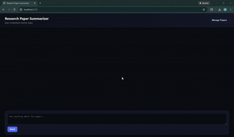
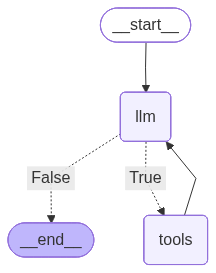

# PaperChat — Research Paper Summarizer (RAG)



<p align="center">
  
</p>
<p align="center">Agent workflow (LangGraph)</p>

A web app that lets you upload research PDFs, ask questions about them, and (when relevant) shows figures/tables alongside the answers.

## Features
- **Paper management**: Upload, list, and delete PDFs directly from the UI.
- **Chat-style Q&A (RAG)**: Ask questions over your uploaded papers with retrieval-augmented responses.
- **Visual support**: When relevant, returns figures/tables as images alongside the answer.
- **Pluggable LLM provider**: Run locally with **Ollama** or use **OpenAI**.

## Tech Stack
### Backend
- Python
- FastAPI
- LangGraph + LangChain
- ChromaDB
- Ollama or OpenAI

### Frontend
- React
- Vite

## Quickstart
### 1) Install
```bash
pip install -r requirements.txt
cd ui
npm install
```

### 2) Run
```bash
python -m uvicorn backend.server:app --reload
```

```bash
cd ui
npm run dev
```

Open `http://localhost:5173`.

## Configuration (optional)
Create a `.env` in the repo root (used by the backend) or set environment variables.

```bash
LLM_PROVIDER=openai   # or ollama
OPENAI_API_KEY=...
DEFAULT_INCLUDE_VISUALS=true
DEFAULT_MAX_PAGES=3
```

### Ollama example
```bash
LLM_PROVIDER=ollama
OLLAMA_MODEL=llama3.2:latest
OLLAMA_EMBEDDINGS_MODEL=nomic-embed-text
```

